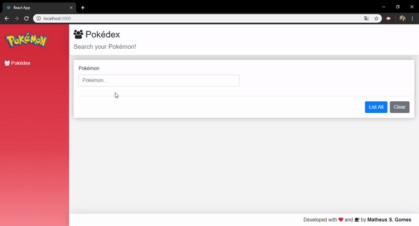
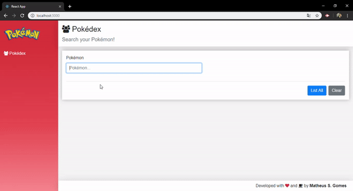
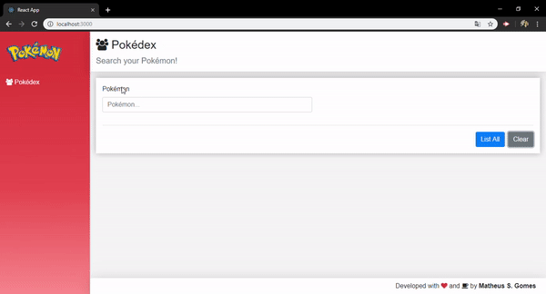
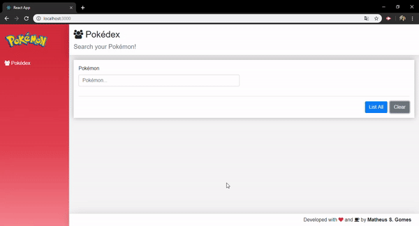

<p align="center"><a target="_blank" href="https://matheus.sgomes.dev"></a></p>
<p align="center">Matheus S. Gomes - <a target="_blank" href="https://matheus.sgomes.dev">https://matheus.sgomes.dev</a></p>

## Projeto para Estudo
#### Pokedex em React
##### Utilizando PokeAPI

#### Preview:



#### Buscar Pokémon

Ao digitar o nome do pokémon no campo, é feita uma busca que retorna o pokémon.
Endpoint:

```bash
https://pokeapi.co/api/v2/pokemon/{id || name}
``` 



#### Abilidades do Pokémon

Ao clicar na habilidade de um pokémon que foi selecionado ou que retornou de uma pesquisa, é exibido os dados dessa habilidade.
Endpoint:

```bash
https://pokeapi.co/api/v2/ability/{id || name}
``` 



#### Lista completa

Ao clicar no botão <b>List All</b> é exibida uma lista com os Pokémons. Exibindo de 40 em 40.

Endpoint:

```bash
https://pokeapi.co/api/v2/pokemon?offset=00&limit=40
``` 

